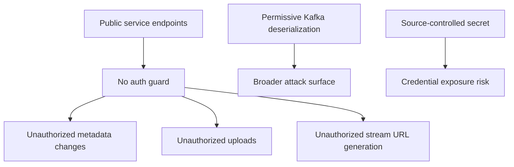
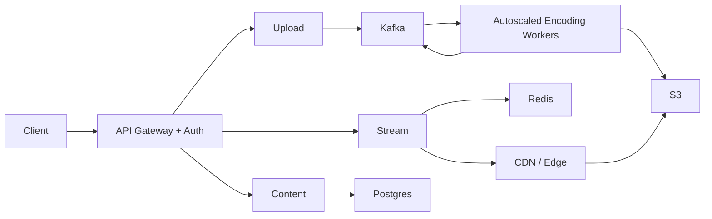

# Holistic Engineering Review

## Overall Assessment

This repository has a sound educational microservice structure and a coherent media-processing narrative. The biggest strengths are **clear service boundaries** and **sensible event-driven workflow decomposition**. The biggest weaknesses are **operational incompleteness**, **missing security**, and **uneven production hardening**.

## Architecture Scorecard

| Area | Assessment | Notes |
|---|---|---|
| Domain separation | Strong | Catalog, upload, encode, and playback are cleanly separated |
| Event-driven workflow | Strong | Kafka is used in the right places for long-running processing |
| Runtime portability | Moderate | AWS/S3 assumptions are clear, FFmpeg pathing is not |
| Security | Weak | No auth/authz, broad trusted packages, source-controlled secret |
| Observability | Weak | Health endpoints exist, full telemetry does not |
| Testability | Weak to moderate | Some tests exist, but coverage is thin and one module shows drift |
| Production readiness | Moderate at best | Core ideas are solid; operations are under-specified |

## Architectural Strengths

### 1. Good responsibility boundaries
- `contentservice` owns metadata and workflow state.
- `videoservice` owns upload validation and raw object creation.
- `encodingservice` owns CPU-heavy media transformation.
- `streamingservice` owns read-optimized playback access.

This is exactly the kind of split that makes sense from first principles because each service is optimized for a different type of work.

### 2. Correct use of asynchronous communication
Encoding is long-running and should not block upload calls. Kafka is an appropriate decoupling mechanism here.

### 3. Private-media delivery model
Using pre-signed S3 URLs is a sound pattern for controlled object access without exposing buckets publicly.

### 4. Incremental defensive refactoring is visible
Comments throughout the code show thoughtfulness about deadlocks, stale caches, path validation, connection cleanup, and schema compatibility.

## Weaknesses and Anti-Patterns

### 1. Security is largely absent
- No authentication
- No authorization
- No entitlement checks for playback
- Broad Kafka trusted package settings
- One source-controlled secret in config

### 2. Operational assumptions are implicit
The code assumes Kafka, PostgreSQL, Redis, S3, and FFmpeg are all available, but the repository only provisions Kafka/Zookeeper locally.

### 3. Tests are not yet a reliable safety net
- Test coverage is minimal in most modules.
- `videoservice` tests appear out of sync with the current controller/service signatures and response model.
- There are no meaningful integration tests for event flow, encoding flow, or streaming cache behavior.

### 4. Some layering leaks remain
`streamingservice` still lets the controller access Redis directly even though comments say that concern should live in the service layer.

### 5. Event robustness is incomplete
The architecture assumes retries/DLQs, but explicit repository-level Kafka error-handling configuration is not present.

## Scalability Risks

### Encoding is the bottleneck
The architecture will scale acceptably for metadata and signed URL reads, but FFmpeg workloads will dominate CPU, disk, and runtime cost.

### Single-service hotspots
- PostgreSQL becomes a central dependency for catalog lookups and workflow state.
- Redis becomes a central dependency for streaming cache availability.
- S3 bandwidth and request rate become central for both upload and streaming.

### Missing horizontal worker orchestration
There is no job queue visibility, no worker autoscaling policy, and no explicit back-pressure handling for spikes in upload volume.

## Maintainability Concerns

### 1. Configuration drift risk
Environment-specific assumptions are scattered across YAML and code comments.

### 2. Contract drift risk
The services rely on field-name compatibility between separately declared event classes/records. That is workable, but it is fragile without shared schemas or contract tests.

### 3. Limited shared platform conventions
There is no shared module for event contracts, tracing conventions, or error envelopes.

## Operational Concerns

- No deployment manifests
- No pipeline automation
- No synthetic checks for event flow health
- No alerting strategy
- No documented backup/recovery approach
- No SLOs or capacity thresholds

## Security Gaps

## Recommended Improvement Roadmap

### Phase 1: Stabilize
- Remove source-controlled secrets.
- Fix or remove stale tests.
- Add local Postgres + Redis + S3-compatible infrastructure docs.
- Add explicit Kafka retry/DLQ config.

### Phase 2: Secure
- Add an API gateway.
- Introduce JWT authentication and basic role/entitlement checks.
- Restrict Kafka trusted packages.
- Introduce audit logging for mutating endpoints.

### Phase 3: Harden
- Add Flyway/Liquibase.
- Add contract tests for `video.uploaded` and `video.encoded`.
- Add OpenTelemetry traces and metrics dashboards.
- Add structured JSON logging and correlation ID propagation everywhere.

### Phase 4: Scale
- Containerize all services.
- Move encoding to autoscaled workers or job-based execution.
- Add queue lag monitoring and worker autoscaling triggers.
- Consider CDN delivery for HLS objects.

## Suggested Future Architecture

## Final Judgment

This is a **good architectural foundation** for a media pipeline demo or a learning project and a reasonable starting point for a real platform. The next leap is not more decomposition; it is **operational maturity**:

- safer configuration,
- stronger contracts,
- real security,
- better observability,
- and a more deliberate encoding-scale model.