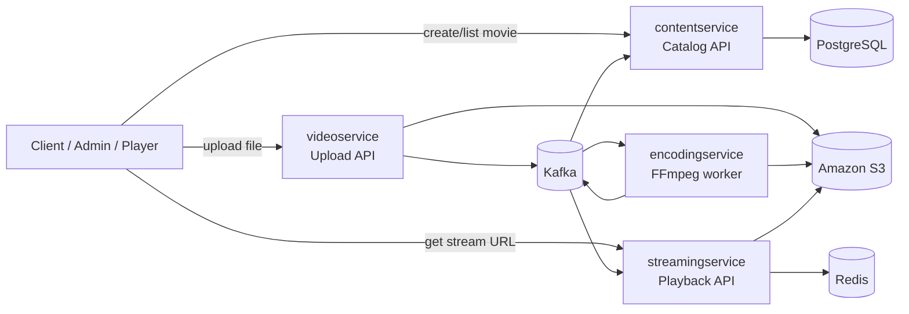
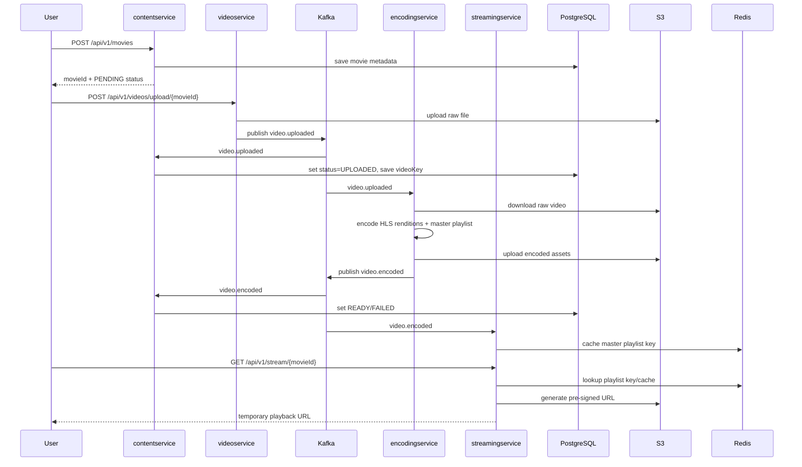
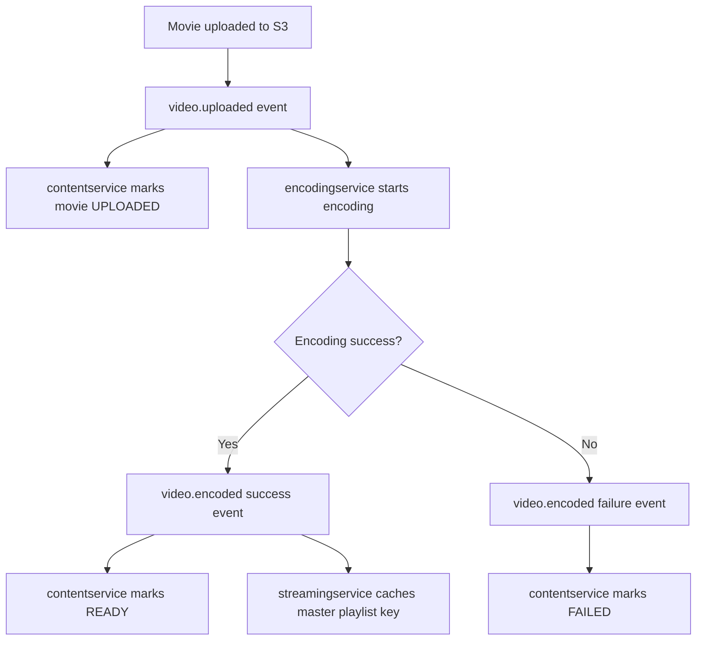
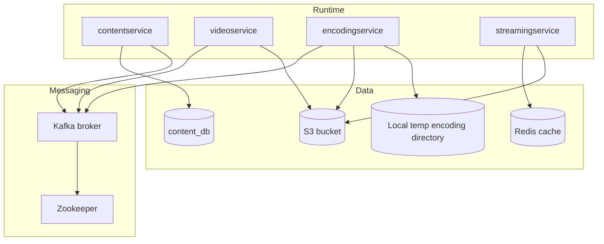
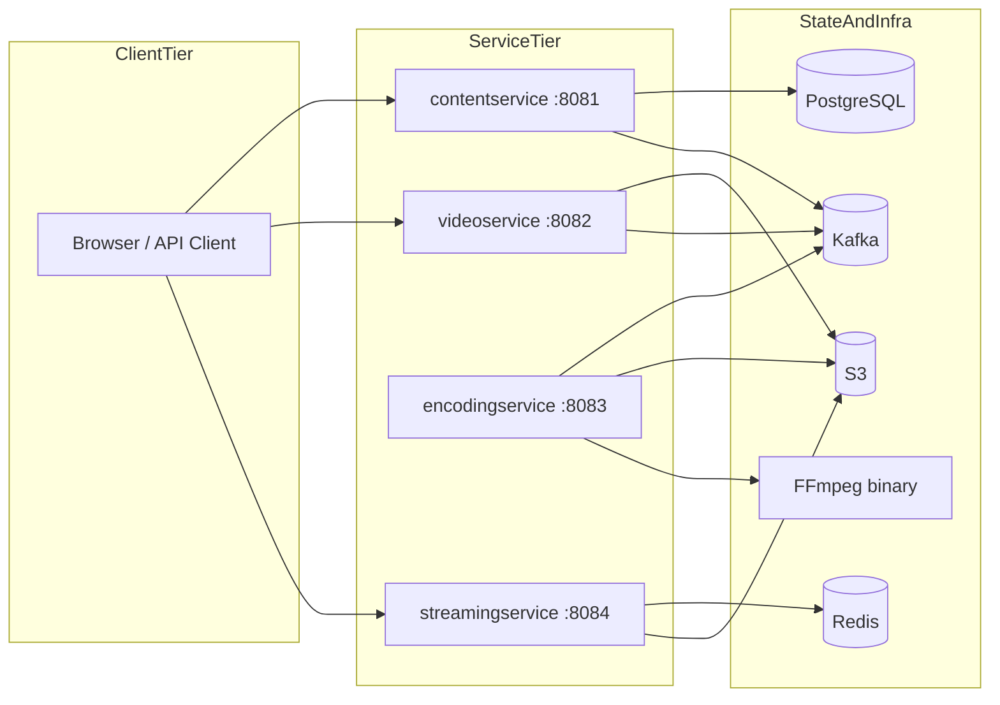
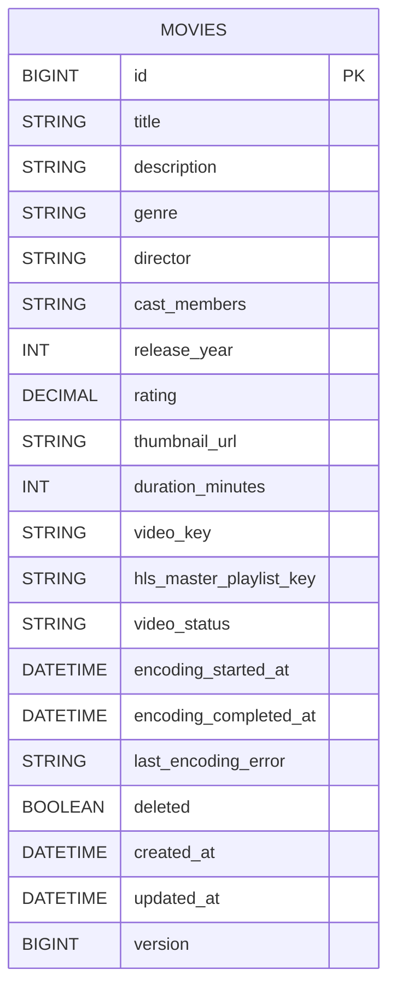

# Netflix Microservices Platform

## Project Overview

This repository implements a small video-on-demand platform split into four Spring Boot services:

- `contentservice` manages movie metadata and catalog state.
- `videoservice` accepts raw video uploads and publishes upload events.
- `encodingservice` consumes upload events, runs FFmpeg-based HLS encoding, and publishes completion events.
- `streamingservice` consumes encoding events, caches playlist locations in Redis, and generates pre-signed streaming URLs.

At a business level, the system solves a simple media workflow problem: **take a movie from catalog entry to uploaded asset to encoded streaming output to playable HLS URL**.

## Business Problem Solved

The platform separates concerns that are usually mixed together in a monolith:

1. **Catalog management** — store metadata, discovery information, and processing state.
2. **Ingestion** — accept large media uploads safely.
3. **Media processing** — convert source files into adaptive bitrate HLS assets.
4. **Playback delivery** — expose temporary signed URLs for private media objects.

This separation makes the architecture easier to reason about and gives each service a focused runtime role.

## System Goals

- Keep movie metadata independent from binary media handling.
- Use event-driven communication for long-running processing steps.
- Support private-object storage in S3 rather than public buckets.
- Allow encoding and streaming concerns to evolve independently.
- Keep the code approachable for learning and extension.

## Design Philosophy

The codebase follows a pragmatic microservice style:

- **Simple REST at the edges** for user-triggered actions.
- **Kafka events in the middle** for asynchronous media workflows.
- **Single responsibility per service** rather than heavy internal frameworks.
- **Infrastructure-first design** around PostgreSQL, S3, Redis, Kafka, and FFmpeg.
- **Incremental hardening** visible in comments and defensive refactors across services.

## Services at a Glance

| Service | Port | Primary Responsibility | Data Store | Produces | Consumes |
|---|---:|---|---|---|---|
| `contentservice` | 8081 | Catalog + workflow state | PostgreSQL | None | `video.uploaded`, `video.encoded` |
| `videoservice` | 8082 | Raw video upload | S3 | `video.uploaded` | None |
| `encodingservice` | 8083 | FFmpeg encoding pipeline | Temp filesystem + S3 | `video.encoded` | `video.uploaded` |
| `streamingservice` | 8084 | Signed playback access | Redis + S3 | None | `video.encoded` |

## High-Level Architecture

## Service Communication

## Event Flow

## Infrastructure Layout

## Deployment Architecture

## Database and State Relationships

The repository uses **one relational table** in `contentservice`. Cross-service relationships are not implemented as foreign keys because the services communicate through Kafka events and shared object storage rather than shared databases.

## Request Lifecycle Across the System

### 1. Catalog creation
- Client sends metadata to `contentservice`.
- The movie is stored in PostgreSQL with `PENDING` status.
- The response includes the generated numeric `movieId`.

### 2. Video ingestion
- Client uploads a media file to `videoservice` using the `movieId`.
- The service validates file size, content type, and filename.
- The raw object is stored under `raw/{movieId}/...` in S3.
- `video.uploaded` is emitted to Kafka.

### 3. Catalog synchronization
- `contentservice` consumes `video.uploaded`.
- It stores the uploaded `videoKey` and moves the movie to `UPLOADED`.

### 4. Encoding
- `encodingservice` consumes the same event.
- It downloads the raw file, validates it, encodes four renditions, creates a master playlist, uploads encoded files, and publishes `video.encoded`.

### 5. Playback preparation
- `contentservice` consumes `video.encoded` and marks the movie `READY` or `FAILED`.
- `streamingservice` consumes `video.encoded` success events and caches the master playlist key in Redis.

### 6. Playback
- Client requests a signed streaming URL from `streamingservice`.
- The service reads Redis, generates a pre-signed S3 URL, and optionally rewrites child playlists with signed segment URLs.

## Authentication and Authorization Flow

There is **no authentication or authorization implementation in the repository today**.

That means:

- Any caller that can reach the services can create metadata, upload videos, delete movies, or request streaming URLs.
- Access to media is protected only by short-lived S3 pre-signed URLs, not by application-level identity checks.

Recommended future flow:

1. API gateway validates JWT or session token.
2. Gateway forwards trusted identity headers to services.
3. Upload and playback endpoints enforce role or entitlement checks.
4. Pre-signed URLs are issued only after entitlement validation.

## Observability Strategy

### Present in the repository
- Spring Boot Actuator is included in all services.
- Health/info endpoints are exposed.
- Services log operational milestones.
- Correlation IDs exist in upload/encoding events.

### Missing or incomplete
- No centralized logging pipeline.
- No metrics dashboards or alerting rules.
- No OpenTelemetry tracing.
- No structured error/event audit trail.
- No DLQ visibility or consumer lag monitoring.

## CI/CD Overview

There are **no CI/CD pipeline definitions** checked into the repository.

What is present:
- Independent Gradle builds for each service.
- `docker-compose.yml` for Kafka/Zookeeper only.

What is absent:
- GitHub Actions, Jenkins, GitLab CI, or similar pipelines.
- Container build definitions per service.
- Kubernetes manifests / Helm charts / Terraform.
- Automated test, lint, or deployment workflows.

## Scaling Strategy

### Current scaling model
- `contentservice` is mostly synchronous and scales with HTTP replicas plus database capacity.
- `videoservice` scales horizontally for upload traffic, bounded by S3 throughput and ingress bandwidth.
- `encodingservice` is the main compute bottleneck and would benefit most from horizontal worker scaling.
- `streamingservice` scales horizontally well if Redis and S3 remain healthy.

### Main scale constraints
- PostgreSQL is a single logical source of truth.
- Redis is a single cache dependency.
- Kafka is single-broker in local compose.
- FFmpeg work is CPU-heavy and file-I/O-heavy.
- S3 and network egress dominate streaming cost.

## Fault Tolerance Approach

The architecture already uses asynchronous messaging, which is a good starting point for resilience, but fault tolerance is still partial.

### Existing resilience patterns
- Event-driven decoupling between upload, encode, and stream preparation.
- Idempotent-ish catalog state transitions in `contentservice`.
- Temporary URL generation rather than public media exposure.
- Cache TTLs in `streamingservice`.

### Gaps
- No explicit retry/backoff/DLQ configuration checked into the repo.
- No outbox pattern for event publication.
- No saga coordination or reconciliation jobs.
- No circuit breakers, bulkheads, or rate limits.
- No infrastructure-as-code for production-grade redundancy.

## Local Runtime Requirements

To run the whole system end to end, you need more than the checked-in compose file:

- Java 21
- Kafka + Zookeeper
- PostgreSQL for `contentservice`
- Redis for `streamingservice`
- AWS S3 bucket and credentials
- FFmpeg installed for `encodingservice`

The checked-in `docker-compose.yml` only provisions **Kafka and Zookeeper**.

## Repository Structure

- `contentservice/contentservice`
- `videoservice/videoservice`
- `encodingservice/encodingservice`
- `streamingservice/streamingservice`
- `docker-compose.yml`

## Recommended Reading Order

1. Root `README.md`
2. `CONFIGURATION_AUDIT.md`
3. `ARCHITECTURE_REVIEW.md`
4. Service-level `README.md`
5. Service-level `ARCHITECTURE_NOTES.md`
6. `postman.md` for manual API exploration