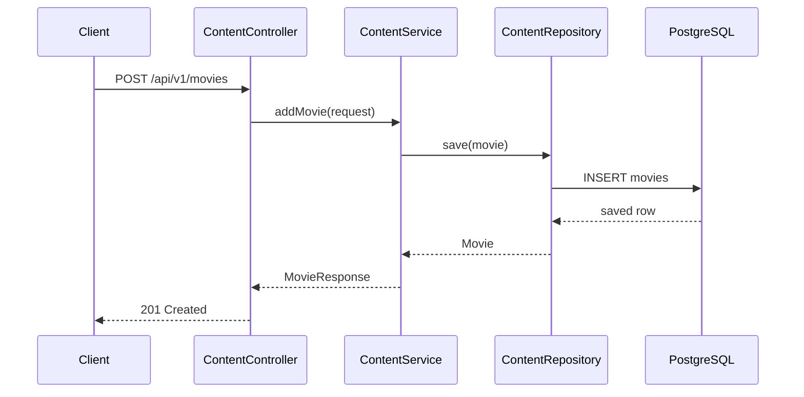
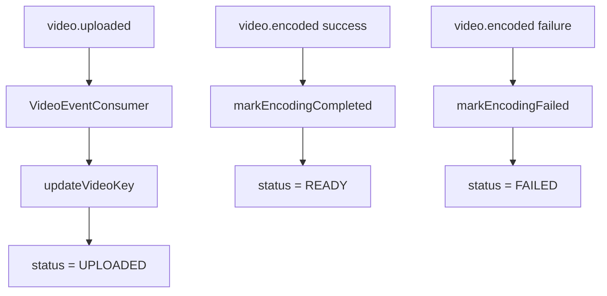
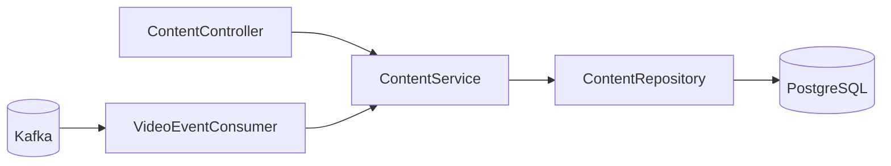
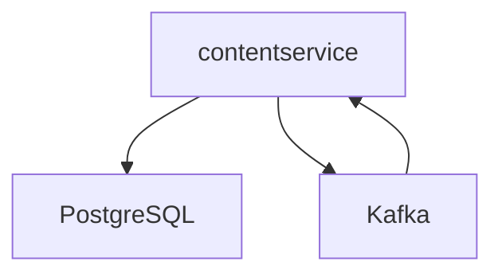

# Content Service

## Overview

`contentservice` is the catalog and workflow-state service for the platform. It stores movie metadata, exposes discovery APIs, and tracks the lifecycle of a movie from `PENDING` to `READY` or `FAILED`.

## Purpose of the Service

This service exists so that the rest of the system has a single source of truth for:

- movie identity,
- descriptive metadata,
- upload state,
- encoding state,
- streaming readiness.

Without it, the platform would have nowhere authoritative to answer questions like:

- “Does this movie exist?”
- “Has the raw file been uploaded?”
- “Did encoding fail?”
- “Is the movie ready to stream?”

## Responsibilities

- Persist movie metadata in PostgreSQL
- Validate create-movie requests
- Serve paginated catalog APIs
- Support soft deletion
- Consume `video.uploaded` events
- Consume `video.encoded` events
- Translate asynchronous pipeline progress into business-facing status fields

## Business Context

From a product perspective, this service is the admin/catalog backbone of the system. End users or internal tools can create a catalog entry first, then attach media later through `videoservice`. That is a common workflow in media operations because metadata often exists before final video assets are available.

## Technical Details

### Tech stack
- Java 21
- Spring Boot 3.5.x
- Spring Web
- Spring Data JPA
- Spring Validation
- Spring Kafka
- PostgreSQL driver
- Lombok

### Key dependencies
- PostgreSQL for durable metadata storage
- Kafka for asynchronous workflow updates

### Configuration explanation

| Key | Meaning |
|---|---|
| `server.port=8081` | Exposes the catalog API on port 8081 |
| `spring.datasource.*` | PostgreSQL connection settings |
| `spring.jpa.hibernate.ddl-auto=update` | Auto-updates schema in development |
| `spring.kafka.bootstrap-servers` | Kafka broker location |
| `spring.kafka.consumer.group-id` | Consumer group for workflow events |
| `management.endpoints.web.exposure.include` | Exposes `health` and `info` |

> Note: a database secret is currently stored directly in the checked-in config. Treat that as a hardening gap, not a recommended practice.

## APIs Consumed and Produced

### REST APIs exposed

| Method | Path | Purpose |
|---|---|---|
| `POST` | `/api/v1/movies` | Create a movie |
| `GET` | `/api/v1/movies` | List movies with pagination |
| `GET` | `/api/v1/movies/{movieId}` | Get one movie |
| `GET` | `/api/v1/movies/genre/{genre}` | Filter by genre |
| `GET` | `/api/v1/movies/search` | Search by title |
| `DELETE` | `/api/v1/movies/{movieId}` | Soft delete a movie |

### Events consumed

| Topic | Payload | Meaning |
|---|---|---|
| `video.uploaded` | `VideoUploadedEvent` | Raw media was uploaded to S3 |
| `video.encoded` | `VideoEncodedEvent` | Encoding completed successfully or failed |

### Events produced
- None directly in the current codebase

## Database Usage

This service owns the only relational data model in the repository.

### Main entity: `Movie`
- `id` uses `GenerationType.IDENTITY`
- includes optimistic locking via `@Version`
- includes soft-delete flag
- stores operational fields such as `videoKey`, `hlsMasterPlaylistKey`, `videoStatus`, and encoding timestamps

### Repository patterns
- `findByDeletedFalse`
- `findByIdAndDeletedFalse`
- paginated search/filter methods

## Deployment / Runtime Requirements

- Java 21
- PostgreSQL database
- Kafka broker
- network access to Kafka and database

## Internal Flow

### Request lifecycle

### Event processing flow

### Component diagram

## Error Handling Strategy

- Validation failures return `400`
- Missing movies raise `MovieNotFoundException` and return `404`
- Generic failures are mapped through `GlobalExceptionHandler`
- Event-driven failures are reflected into `videoStatus=FAILED` and `lastEncodingError`

## Notable Design Choices

- Soft deletes preserve historical records and avoid hard loss of metadata.
- The service is intentionally event-aware but not event-producing.
- Workflow state is stored in business entities, making the API user-friendly.

## Dependency View

## Current Limitations

- No auth/authz for catalog mutation
- Hardcoded topic names in consumers
- `ddl-auto=update` is not production-safe
- One repository-level test only; behavioral coverage is very limited