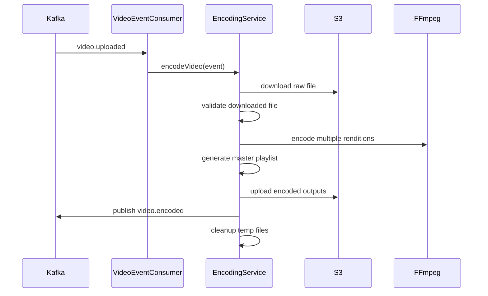
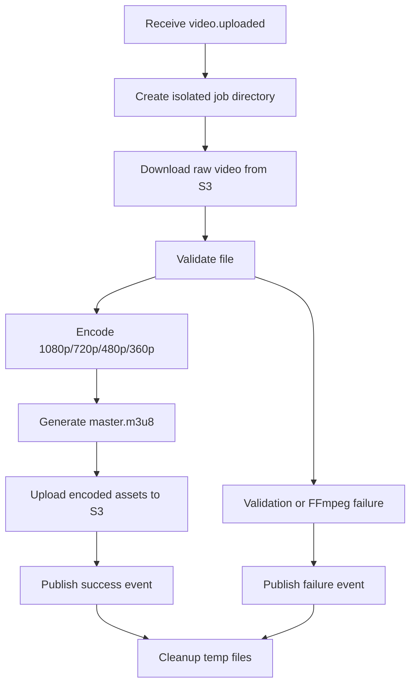
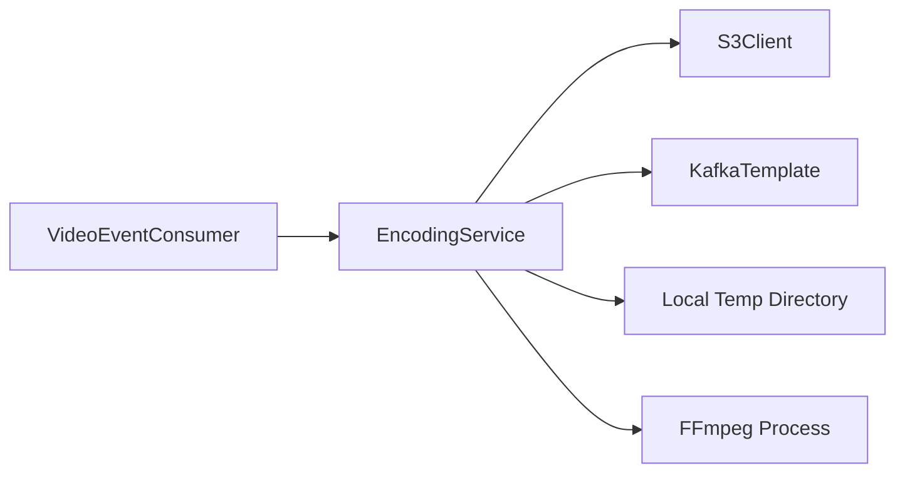
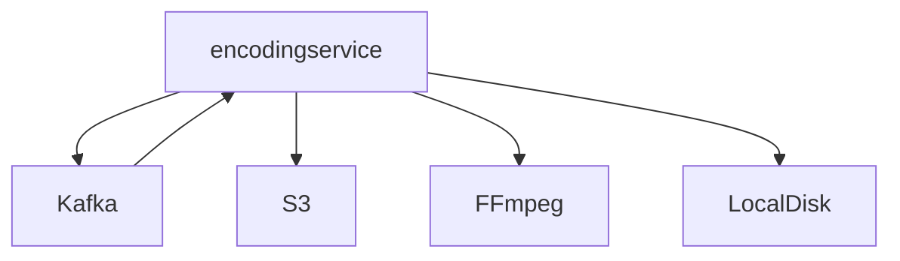

# Encoding Service

## Overview

`encodingservice` is the asynchronous media-processing worker of the platform. It listens for uploaded-video events, downloads the raw file, runs FFmpeg to create HLS renditions, uploads the encoded outputs, and publishes a completion event.

## Purpose of the Service

This service exists because media transcoding is:

- CPU-heavy,
- I/O-heavy,
- long-running,
- failure-prone,
- and operationally different from standard request/response APIs.

It should not run inside the synchronous upload or catalog services.

## Responsibilities

- Consume `video.uploaded`
- Download raw assets from S3
- Validate downloaded files
- Encode 1080p, 720p, 480p, and 360p renditions
- Generate HLS master playlist
- Upload encoded files back to S3
- Publish `video.encoded`
- Clean up local temp files

## Business Context

This service transforms a stored source file into something that can actually be streamed by a video player. It is the bridge between ingestion and playback.

## Technical Details

### Tech stack
- Java 21
- Spring Boot 3.5.x
- Spring Kafka
- AWS SDK for S3
- FFmpeg
- local filesystem temp storage
- Lombok

### Key dependencies
- Kafka for work intake and completion signaling
- S3 for input/output media objects
- FFmpeg for transcoding

### Configuration explanation

| Key | Meaning |
|---|---|
| `server.port=8083` | Service port, mainly for actuator/runtime presence |
| `spring.kafka.consumer.group-id` | Consumer group for uploaded-video events |
| `kafka.topics.video-uploaded` | Input topic |
| `kafka.topics.video-encoded` | Output topic |
| `aws.s3.bucket-name` | Source and destination bucket |
| `ffmpeg.path` | Location of FFmpeg binary |
| `encoding.base-path` | Local temp working directory |

## APIs / Events Consumed and Produced

### Public HTTP APIs
- None currently exposed beyond generic Spring Boot runtime presence

### Events consumed

| Topic | Payload | Meaning |
|---|---|---|
| `video.uploaded` | `VideoUploadedEvent` | Start encoding job |

### Events produced

| Topic | Payload | Meaning |
|---|---|---|
| `video.encoded` | `VideoEncodedEvent` | Encoding succeeded or failed |

## Database Usage

- No relational database
- Uses local temp filesystem during processing
- Uses S3 as durable storage for encoded outputs

## Deployment / Runtime Requirements

- Java 21
- FFmpeg installed and reachable at configured path
- Kafka broker
- S3 credentials and bucket
- enough CPU, disk, and temp storage for transcoding jobs

## Internal Flow

### Event-driven encoding sequence

### Encoding flowchart

### Component diagram

## Error Handling Strategy

- Invalid downloaded files raise `InvalidVideoFileException`
- FFmpeg failures raise `FFmpegException`
- Generic failures result in a failure `video.encoded` event
- Temp files are cleaned in `finally`
- Consumer rethrows failures so Kafka retry/DLQ behavior can apply if configured externally

## HLS Output Model

Current encoding ladder:

- 1080p @ 5000 kbps
- 720p @ 2800 kbps
- 480p @ 1200 kbps
- 360p @ 800 kbps

Output prefix pattern:

- `encoded/{movieId}/...`

## Dependency Diagram

## Current Limitations

- FFmpeg path is checked in with a Windows-specific default
- retry/DLQ behavior is discussed in comments but not fully configured in repo config
- no job queue metrics or back-pressure management
- no public operational API beyond logs/actuator
- tests are minimal