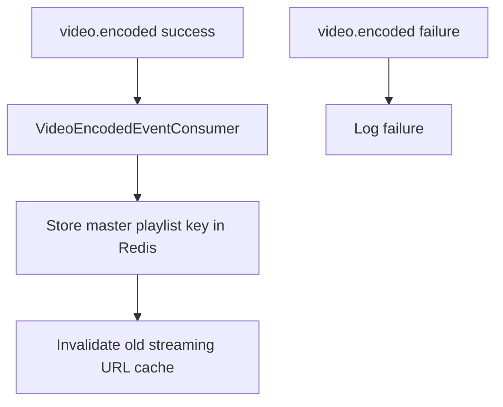
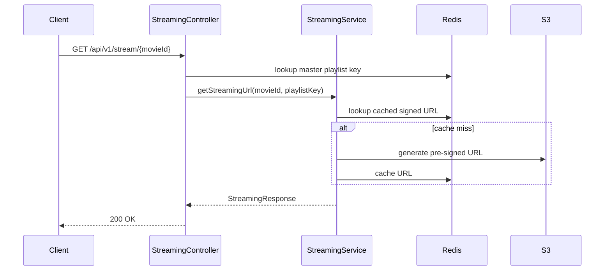
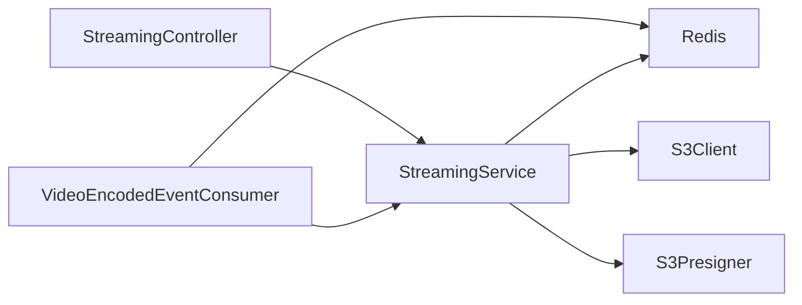

# Streaming Service

## Overview

`streamingservice` is the playback access layer of the platform. It listens for encoding-completion events, caches HLS playlist locations in Redis, generates pre-signed S3 URLs, and rewrites playlist contents so players can fetch segments securely.

## Purpose of the Service

This service exists because secure media playback is a different concern from both catalog management and encoding. It focuses on read-optimized delivery rather than long-running processing or metadata ownership.

## Responsibilities

- Consume `video.encoded` success/failure events
- Cache master playlist keys in Redis
- Generate pre-signed HLS master playlist URLs
- Rewrite referenced playlists/segments as signed URLs
- Cache generated URLs and signed playlist text for short periods

## Business Context

The system wants private media storage but still needs playable URLs for clients. `streamingservice` is the adapter that turns private S3 objects into temporary playback access.

## Technical Details

### Tech stack
- Java 21
- Spring Boot 3.5.x
- Spring Web
- Spring Data Redis
- Spring Kafka
- AWS SDK for S3 + S3 Presigner
- Lombok

### Key dependencies
- Redis for short-lived cache state
- S3 for playlists and segment references
- Kafka for encoded-video notifications

### Configuration explanation

| Key | Meaning |
|---|---|
| `server.port=8084` | Playback API port |
| `spring.data.redis.*` | Redis connection |
| `spring.kafka.consumer.group-id` | Consumer group for encoded events |
| `kafka.topics.video-encoded` | Topic carrying encoding results |
| `aws.s3.bucket-name` | Bucket containing encoded assets |
| `aws.s3.presigned-url-expiry` | URL expiry window in minutes |

## APIs / Events Consumed and Produced

### REST APIs exposed

| Method | Path | Purpose |
|---|---|---|
| `GET` | `/api/v1/stream/{movieId}` | Return signed master playlist URL |
| `GET` | `/api/v1/stream/{movieId}/playlist?path=...` | Return rewritten signed M3U8 text |

### Events consumed

| Topic | Payload | Meaning |
|---|---|---|
| `video.encoded` | `VideoEncodedEvent` | Playlist key is ready or encoding failed |

### Events produced
- None in current implementation

## Database / Cache Usage

- No relational database
- Redis stores:
  - master playlist keys by movie ID
  - pre-signed streaming URLs
  - short-lived rewritten playlist bodies

## Deployment / Runtime Requirements

- Java 21
- Redis
- Kafka
- S3 bucket with encoded content
- AWS credentials for S3 and presigning

## Internal Flow

### Event handling flow

### Request lifecycle

### Component diagram

## Error Handling Strategy

- Missing playlist key returns `404` from controller
- Invalid playlist path results in failure from service validation
- S3 read failures become runtime exceptions
- failed encoding events are logged rather than surfaced through an API call

## Security Model

- Encoded objects remain private in S3
- Playback access is granted through time-limited pre-signed URLs
- Playlist path validation prevents callers from requesting arbitrary S3 keys outside the expected movie prefix

## Current Limitations

- No auth/authz before issuing streaming URLs
- Controller still reaches into Redis directly, which is a layering compromise
- available qualities are hardcoded in the response
- invalid playlist path errors are not mapped through a dedicated exception handler
- tests are minimal