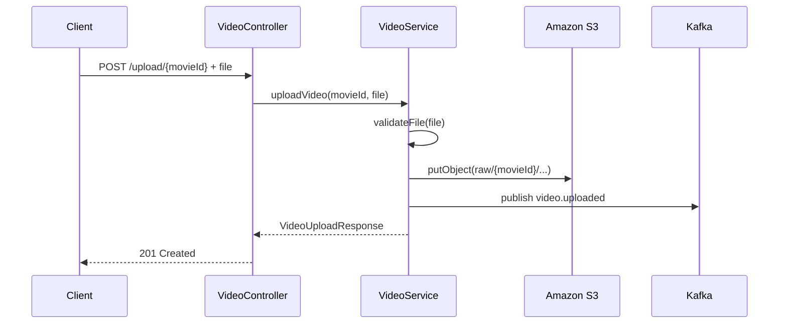
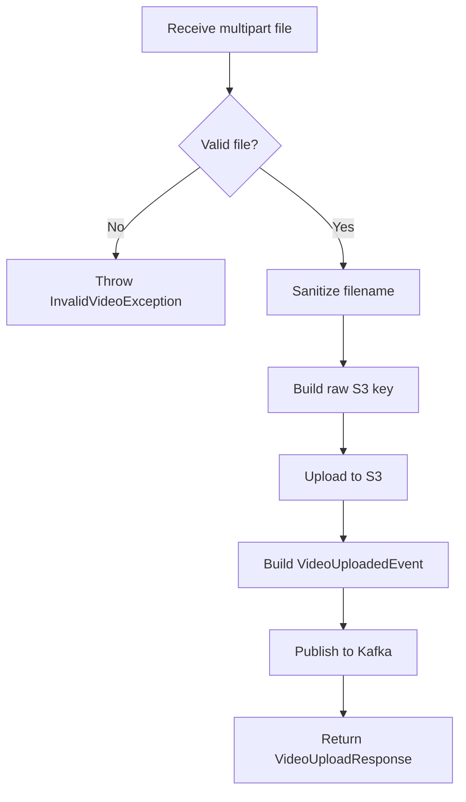
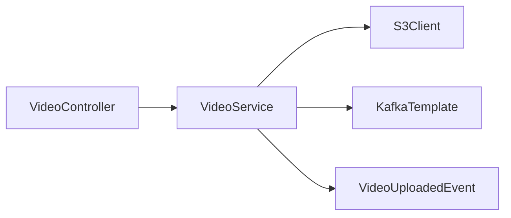

# Video Service

## Overview

`videoservice` is the ingestion edge of the platform. It accepts multipart video uploads, validates them, stores raw media in S3, and emits an event so downstream encoding can begin.

## Purpose of the Service

This service exists because raw binary upload handling has a very different runtime profile from metadata CRUD:

- larger payloads,
- different validation rules,
- S3-oriented storage logic,
- and asynchronous post-processing.

Separating upload from catalog management keeps the catalog service lightweight and focused.

## Responsibilities

- Accept multipart media uploads
- Validate file presence, size, content type, and filename
- Generate S3 storage keys
- Upload objects to S3
- Attach metadata such as `movieId` and correlation ID
- Publish `video.uploaded` events to Kafka

## Business Context

This service represents the ingestion gateway for media operations. It bridges human or system upload actions into the asynchronous processing pipeline used by encoding and streaming.

## Technical Details

### Tech stack
- Java 21
- Spring Boot 3.5.x
- Spring Web
- Spring Kafka
- AWS SDK for S3
- Lombok

### Dependencies
- Kafka for upload event publication
- S3 for raw media storage

### Configuration explanation

| Key | Meaning |
|---|---|
| `server.port=8082` | Upload API port |
| `spring.servlet.multipart.max-file-size` | Spring request-level upload guard |
| `spring.servlet.multipart.max-request-size` | Request-level size limit |
| `spring.kafka.bootstrap-servers` | Kafka broker location |
| `kafka.topics.video-uploaded` | Topic published after S3 upload |
| `aws.*` | AWS region, credentials, and bucket selection |

## APIs / Events Consumed and Produced

### REST APIs exposed

| Method | Path | Purpose |
|---|---|---|
| `POST` | `/api/v1/videos/upload/{movieId}` | Upload a raw video file |

### Events produced

| Topic | Payload | Meaning |
|---|---|---|
| `video.uploaded` | `VideoUploadedEvent` | Raw media is persisted and ready for encoding |

### Events consumed
- None in the current implementation

## Database Usage

- No relational database
- S3 is the durable storage system for uploaded binaries

## Deployment / Runtime Requirements

- Java 21
- Kafka broker
- AWS credentials or compatible local S3 credentials
- reachable S3 bucket
- enough network bandwidth for large file uploads

## Internal Flow

### Upload request lifecycle

### Processing flowchart

### Dependency diagram

## Error Handling Strategy

- Empty, oversized, unsupported, or nameless files raise `InvalidVideoException` (`400`)
- I/O failures while reading the upload stream raise `VideoUploadException` (`500`)
- Kafka send failures are logged asynchronously in the completion callback

## Validation Logic

Current validation rules:

- file must not be empty
- file must be <= 2 GB
- content type must be one of:
  - `video/mp4`
  - `video/x-matroska`
  - `video/quicktime`
- original filename must exist and not be blank

## Current Limitations

- No authentication or authorization
- No resumable/chunked upload support
- No virus scanning or media fingerprinting
- No persistence of upload history in a database
- `S3Presigner` bean exists but is unused in the current code
- test suite appears to lag behind the current response model and controller behavior